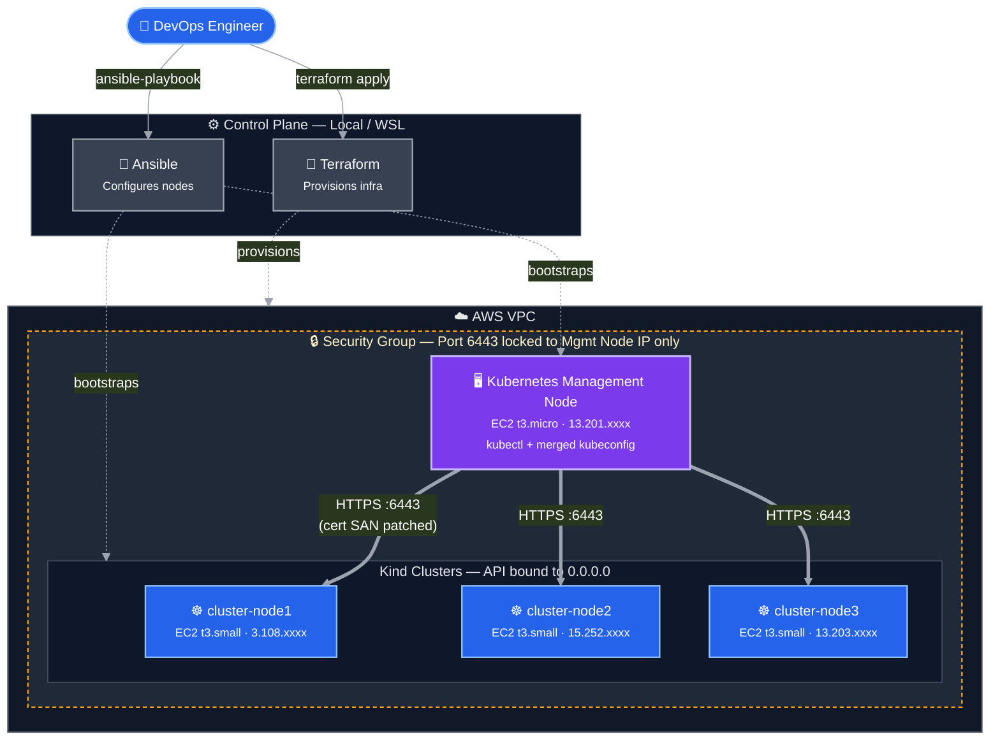

# Kubernetes Multi-Cluster Infrastructure on AWS — Terraform + Ansible

This repository contains the complete Infrastructure-as-Code (IaC) and Configuration Management to deploy a highly secure, multi-cluster Kubernetes environment on AWS. It is built entirely from scratch using **Terraform** for provisioning and **Ansible** for configuration, targeting a secure Hub-and-Spoke management architecture.

---

## 🏗️ Architecture Overview

The infrastructure provisions 4 Ubuntu EC2 instances within an AWS VPC. 
Rather than manually logging into cluster nodes, a centralized **Kubernetes Management Node** acts as the secure Bastion/Management hub to interact with 3 separate Kubernetes clusters remotely.

### Architecture Diagram



### Provisioned Instances

| Instance Name | Instance Type | Role | Masked IP |
| ------------- | ------------- | ---- | --------- |
| **Kubernetes Management Node** | `t3.micro` | Central Management Hub (`kubectl`, Ansible) | `13.201.xxxx` |
| **cluster-node1** | `t3.small` | Kubernetes Cluster 1 (Control Plane + Worker) | `3.108.xxxx` |
| **cluster-node2** | `t3.small` | Kubernetes Cluster 2 (Control Plane + Worker) | `15.252.xxxx` |
| **cluster-node3** | `t3.small` | Kubernetes Cluster 3 (Control Plane + Worker) | `13.203.xxxx` |

---

## 📂 Repository Structure

```text
.
├── Ansible/
│   ├── inventory.ini               # Dynamic IP mapping and SSH configuration
│   ├── setup-dependencies.yml      # Installs Docker, Kind, and Kubectl
│   ├── create-kind.yml             # Bootstraps clusters with patched SANs
│   ├── setup-client-access.yml     # Fetch-and-push Kubeconfig management
│   └── fetched_configs/            # (Gitignored) Temporary Kubeconfig storage
├── Keys/
│   └── aws-infra-key               # SSH Private Key for AWS instances
├── terraform/
│   ├── provider.tf                 # AWS Provider configuration
│   ├── variables.tf                # Variable definitions
│   ├── terraform.tfvars            # Variable assignments (Region, Instance Types)
│   ├── security.tf                 # Strict AWS Security Groups (Port 22, 80, 443, 6443)
│   ├── ec2.tf                      # Provisions the 4 EC2 instances
│   └── outputs.tf                  # Outputs the Public IPs after creation
├── .gitignore                      # Excludes TF state, sensitive keys, and local configs
└── README.md                       # Documentation
```

---

## 🧠 Interview POV: Technical Challenges & Resolutions

During the engineering of this infrastructure, several complex networking, security, and architectural challenges were encountered and methodically solved. These points highlight active debugging of network security, TLS certificates, and Kubernetes networking architectures.

### 1. Challenge: Secure Remote API Server Binding
**What we did:** We reconfigured the `kind` cluster bootstrapping process to bind the API server to `0.0.0.0` instead of the default `127.0.0.1`.
**Why we did it:** By default, `kind` (Kubernetes in Docker) binds the Kubernetes API Server strictly to localhost (`127.0.0.1`). This is an excellent security default for local development, as it prevents any external access. However, in our Hub-and-Spoke architecture, our central **Kubernetes Management Node** resides on a completely different EC2 instance. Because the API server was locked to localhost, the Management Node could not establish a network connection to the API server because the API server was bound to localhost on the cluster node.
**How we solved it:** We could not simply put the Management Node's IP in the configuration, as the cluster node cannot bind to an IP it does not own. Instead, we used Ansible to inject a custom `kind-config.yaml` during cluster creation that explicitly sets `apiServerAddress: "0.0.0.0"`. This instructs Kind to map the API server port to the EC2 host's network interfaces, allowing the remote Management Node to establish a connection to the EC2 address on port 6443.

### 2. Challenge: Network Security & Firewall Hardening
**What we did:** We implemented a strict Ingress rule in AWS via Terraform for Port `6443`.
**Why we did it:** Solving the first challenge (binding the API to `0.0.0.0`) inherently created a massive security vulnerability: the Kubernetes API was now technically accessible to the entire internet. Relying on internal OS-level firewalls (like UFW) is prone to configuration drift.
**How we solved it:** We leveraged AWS Security Groups (managed via Terraform). We created a strict `ingress` rule for Port `6443` (the K8s API port) where the `cidr_blocks` was locked down *exclusively* to the Kubernetes Management Node's IP address (`13.201.93.142/32`). This restricts API-server access to traffic originating from the trusted Management Node. AWS drops any unauthorized packets at the network edge before they ever reach the EC2 instance.

### 3. Challenge: x509 TLS Certificate SAN Mismatch
**What we did:** We patched the internal Kubernetes Certificate Authority (CA) generation to include the AWS EC2 Public IPs.
**Why we did it:** After opening the firewall, `kubectl` still failed to connect, throwing a fatal TLS error: 
`x509: certificate is valid for 10.96.0.1, 172.18.0.3, 0.0.0.0, not <AWS_IP>`. 
Kubernetes is secure by design. When `kubeadm` (under the hood of `kind`) bootstraps a cluster, the internal CA signs the API server's SSL certificate. It only includes the internal Docker and Kubernetes network IPs in the certificate's SAN (Subject Alternative Names) list. When our remote Management Node attempted to connect using the AWS IP address, `kubectl` compared the AWS IP against the IPs on the SSL certificate. Because they didn't match, `kubectl` suspected a Man-In-The-Middle (MITM) attack and terminated the connection.
**How we solved it:** A common anti-pattern is to bypass this by running `kubectl` with `--insecure-skip-tls-verify`. Instead of compromising security, we fixed it at the root. We utilized Ansible to dynamically patch the `kubeadm` configuration before cluster creation. We injected a `kubeadmConfigPatches` block into the `kind` config, using the `{{ ansible_host }}` variable to dynamically add the specific EC2 instance's IP to the `certSANs` array. Upon wiping and recreating the clusters, the CA generated perfectly valid, highly-secure SSL certificates that recognized the AWS IPs.

### 4. Challenge: Centralized Kubeconfig Management (Hub-and-Spoke)
**What we did:** We developed an automated Ansible "Fetch-and-Push" playbook to centralize cluster credentials.
**Why we did it:** To manage 3 independent clusters, the Management Node required the authentication credentials (`kubeconfig`) for all of them. Manually copying these files is error-prone. Furthermore, the Management Node and Cluster Nodes do not share SSH keys, preventing direct SCP transfers between them. Lastly, the default `kubeconfigs` generated by `kind` pointed to `0.0.0.0`, which is not directly usable by a remote client.
**How we solved it:** We developed `setup-client-access.yml`:
1. **Fetch**: Ansible (running on our local WSL control machine) securely downloaded the 3 `kubeconfig` files from the cluster nodes.
2. **Push**: Ansible uploaded these configs to the Kubernetes Management Node.
3. **Regex Transformation**: We utilized the Ansible `shell` module and `sed` to dynamically rewrite `0.0.0.0` to the actual AWS IP addresses of each specific cluster.
4. **Context Merging**: We updated the Management Node's `~/.bashrc` to export a chained `KUBECONFIG` variable (`export KUBECONFIG=config1:config2:config3`). 
This seamless integration enables the DevOps engineer to simply append `--context kind-cluster-node1` to immediately switch management targets.

---

## 🧠 Key Concepts Practiced

- Kubernetes control plane and worker architecture
- Kind-based Kubernetes clusters
- Kubernetes API Server and port 6443
- kubectl and kubeconfig
- Kubernetes contexts and multi-cluster management
- Pod, node, and API-server networking
- TLS certificates and SANs
- AWS Security Groups
- Terraform infrastructure provisioning
- Ansible configuration management
- Remote cluster administration
- Infrastructure troubleshooting

---

## 🛠️ Usage & Deployment Pipeline

The infrastructure is deployed in 3 automated phases:

### Phase 1: Infrastructure Provisioning (Terraform)
Navigate to the `terraform/` directory.
```bash
terraform init
terraform apply --auto-approve
```
*This spins up strict Security Groups and 4 EC2 instances within an existing AWS VPC.*

### Phase 2: Dependency Installation (Ansible)
Navigate to the `Ansible/` directory.
```bash
ansible-playbook -i inventory.ini setup-dependencies.yml
```
*This playbook installs Docker and Kind on the cluster nodes, and Kubectl on the management node.*

### Phase 3: Cluster Bootstrapping & Client Config (Ansible)
```bash
# 1. Create the 3 Kind clusters with patched SANs and 0.0.0.0 binding
ansible-playbook -i inventory.ini create-kind.yml

# 2. Fetch configs, rewrite IPs, and push to Management Node
ansible-playbook -i inventory.ini setup-client-access.yml
```

### Verification
SSH into the **Kubernetes Management Node** and verify connectivity across all environments:
```bash
source ~/.bashrc
kubectl get nodes --context kind-cluster-node1
kubectl get nodes --context kind-cluster-node2
kubectl get nodes --context kind-cluster-node3
```
